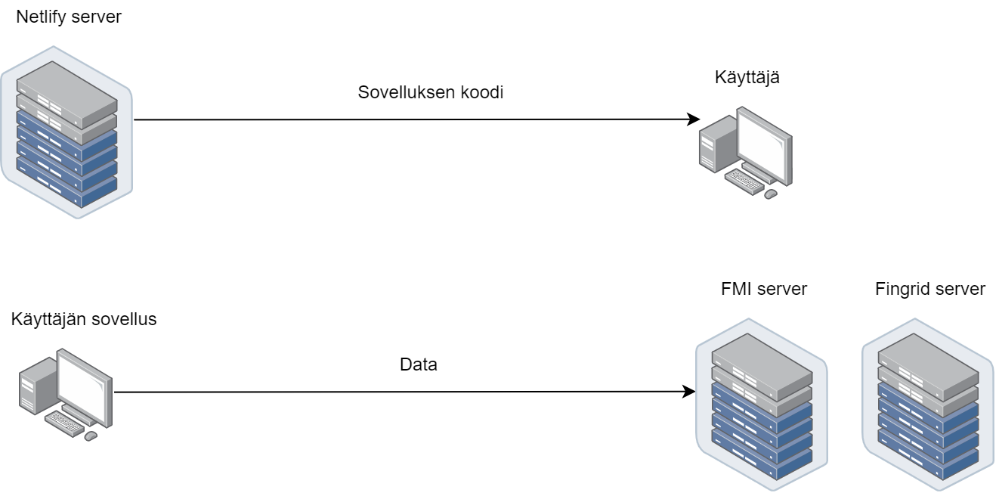
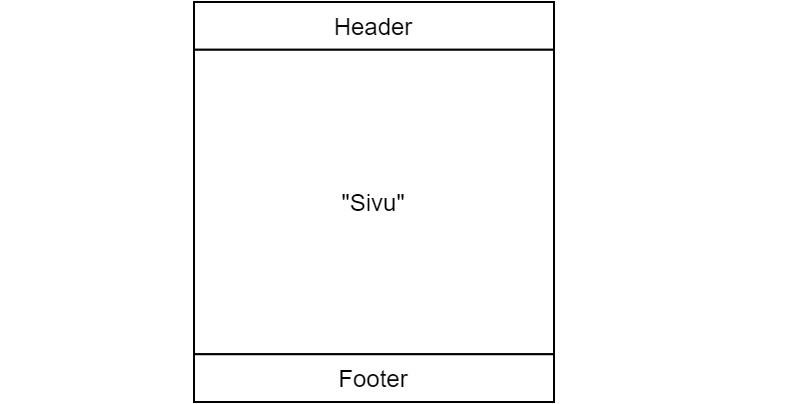
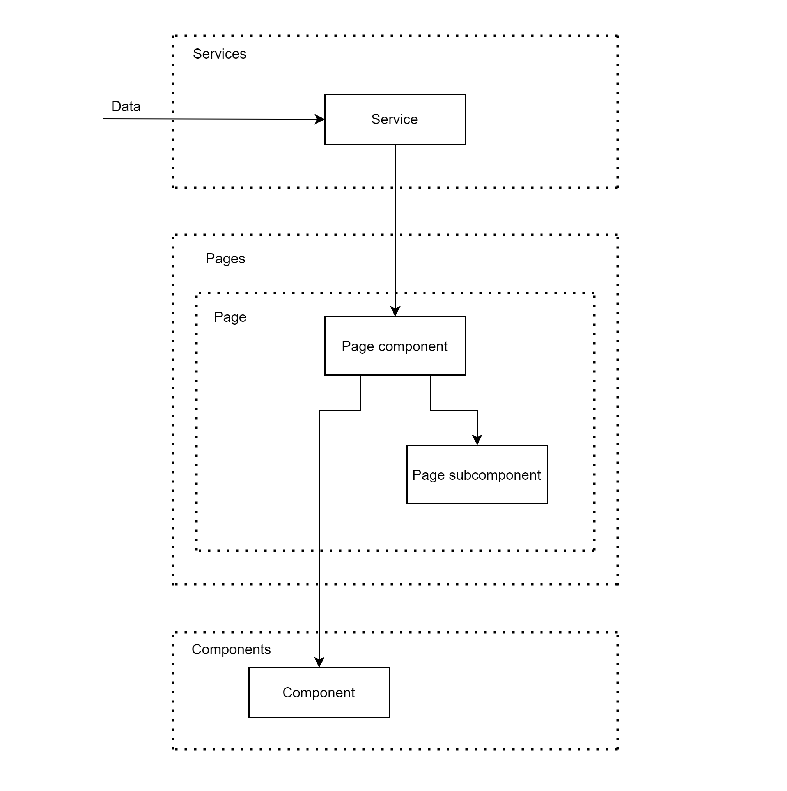

# Design dokumentti - 0xc0ff3e

## Sisällysluettelo

[[_TOC_]]

Ratkaisumme kurssin määrittelemään tehtävään on kirjoittaa React-pohjainen web-sovellus, joka hakee datan suoraan tietolähteiden API:sta ajon aikaisesti. Hyödynnämme projektissa moderneja teknologioita sekä työkaluja. Projektin kielenä toimii TypeScript.

Modernin web-ohjelmoinnin tarjoamat menetelmät ja rajapinnat sopivat täydellisesti kurssin projektin toteuttamiseksi. Molemmat APIt ovat myös itsessään web-sovelluksia, joten web-sovelluksen tekeminen on luonnollinen ratkaisu.

Typescriptin tarjoama vahva tyypitys ja Reactin tapa erotella komponentin funktionaalisiksi kokonaisuuksiksi täyttää kurssilla esitellyt modulaarisuuden ja OOP-mallin vaatimukset jaotella koodia. Näin tiimityöskentely helpottuu ja projektia on myös helppo laajentaa tulevaisuudessa.

## Prototyypit

Alla linkit Figmassa toteutettuihin prototyyppeihin sovelluksen työpöytä- ja mobiiliversioista

- [Työpöytäversio](https://www.figma.com/proto/hUkQpST2beG7YZ00qm2K2q/Prototype?node-id=57%3A158&scaling=scale-down)
- [Mobiiliversio](https://www.figma.com/proto/hUkQpST2beG7YZ00qm2K2q/Prototype?node-id=20%3A933&scaling=scale-down)

## Arkkitehtuuri

Arkkitehtuuri oli pitkälti suunniteltu etukäteen. Tämä oli mahdollista kokemuksen ansioista, joka oli jo olemassa Reactilla suunnitelluista web sovellukisista. Pienessä sovelluksessa voi ennalta tiedostaa sopivan rakenteen, toisin kuin suuremmassa sovelluksessa. Myös teknologiavalinnoilla on ansionsa projektin yksinkertaisuuteen. Reactia käytettäessä käyttöliittymän tekeminen on suhteellisen helppoa. Näin ollen logiikka ja ohjelmointityö, mitä vaaditaan käyttöliittymän suunnittelluun on verrattain pientä, verrattuna esimerkiksi C++:aan Qt:lla. React antaa viitekehyksen, jonka käyttäminen välttää monet kompastuskivet, kuten datan tilaan liittyvät asiat käyttöliittymän kannalta. Reactin komponenttiajattelu kannustaa myös modulaariseen ajatteluun, vaikka ei se takaa vielä modulaarisuutta. Vielä yksi syy yksinkertaiseen arkkitehtuuriin on valmiiden kirjastojen käyttäminen, joita Reactin ja web ekosysteemin ansioista on olemassa. Näistä esimerkkinä mainittakoon Highcharts, joka tarjosi yksinkertaisen sisäisen rajapinnan kuvaajien tekemiseksi. Tarkemmat tiedot kolmannen osapuolien kirjastoista löytyvät [alempaa](#kolmannen-osapuolen-kirjastot-ja-työkalut).

## Kolmannen osapuolen kirjastot ja työkalut

Alla on listattu kirjastoja ja työkaluja, joita olemme suunnitelleet käytettäväksi projektin toteutukseen.

- [React](https://reactjs.org/)
  - Koko applikaation "aivot"
  - Hallitsee koko käyttölittymää
- [React router](https://reactrouter.com/)
  - Helpottaa käyttäjän navigointia käyttöliittymässä
  - Pitää URLn synkronoituna näkymän kanssa
- [Highcharts](https://www.npmjs.com/package/highcharts-react-official)
  - Datan visualisointi ja filtteröinti
  - Interaktiivinen
  - "Make your data come alive"
- [Tailwind CSS](https://tailwindcss.com/)
  - Visuaalinen ilme
  - Käyttöliittymän asettelu ja skaalaus
  - Responsiivisuus (mobiilinäkymä)
- [Axios](https://github.com/axios/axios)
  - Datan noutaminen ja parsiminen
- Gitlab
  - Projektinhallinta
  - CI/CD

### Sovelluksen toimintaperiaate

Kuten aluksi mainittiin, sovellus hakee ajon aikana datan API:sta, ja näin ollen minkäänlaiselle backendille ei ole tarvetta. Mikäli on tarvetta tallentaa jotain tietoa myöhemmässä vaiheessa, voidaan siihen käyttää selaimen välimuistia. Seuraava kuvaaja auttaa hahmottamaan, kuinka tämä sovellus käytännössä toimii.



Vieraillessasi sivulla palvelin lähettää sovelluksen tietokoneellesi, jonka selain ajaa tietopaketin tultua perille. Teknisesti sanottuna olemme toteuttaneet sovelluksemme SPA (Single page app) tyylisesti, eli perinteiseen web kehitykseen verrattuna lähetetään vain yksi HTML tiedosto, jonka jälkeen JavaScriptillä muokataan käyttäjän näkymää. Tässä sovelluksessa dynaamista sisältöä on FMI:n ja Fingridin tarjoama data, jota visualisoidaan kuvaajina näytöllä.

### Sovelluksen kansiorakenne

App kansiosta löytyy sovellus kokonaisuudessaan sisältäen kaiken konfiguraation sun muut asiat, mitkä liittyvät sovelluksen kehitykseen. Alla selitettynä kansiorakenne. Sovelluksen pohja on luotu [Create React Appin](https://create-react-app.dev/) avulla ja siitä on lähetty laajentamaan.

```
├── public                       # Tärkein tiedosto on index.html, joka on se ainut html tiedosto, mikä lähetetään SPA sovellusta tehdessä.
├── src                          # Sovelluksen koodi. Tästä lisää alempana
├── .eslintignore                # Vertaa .gitignore. Sama asia staattiselle tarkastusohjelmalle
├── .eslintrc                    # Staattisen tarkastusohjelman konfiguraatio
├── .prettierignore              # Vertaa .gitignore. Sama asia formatointiohjelmalle
├── .prettierrc                  # Koodin formatointiohjelma.
├── craco.config.js              # Konfiguraatiohelvetin yksi palasista. Lisää kustomointimahdollisuuksia CRA:lle.
├── package-lock.json            # Sovelluksen kirjastojen riippuvuksien tarkat versiot ja riippuvuudet.
├── package.json                 # Projektin tärkeimmät tiedot liittyen riippuvuuksiin yms.
├── tailwind.config.js           # Tailwindin konfiguraatio
├── tsconfig.json                # TypeScriptin konfiguraatio
├── tsdoc.json                   # TypeDocin eli dokumentaatiogeneraattorin konfiguraatio
```

### Sovelluksen UI:n rakenne

Sovellusta tehdessä pyrittiin löytämään intuitiivista rakennetta, joka auttaa hahmottamaan vastuualueet selkeästi. Sovelluksessa on yksi layout, joka vastaa näkymän rakenteesta riippumatta mikä näkymä on kyseessä. Näkymää kutsumme sivuksi, koska sivun vaihtaminen on intuitiivinen käsite web sovelluksissa (vrt. sana nettisivu). Layoutin rakenne on myös web sovelluksista tuttu. Header, joka toimii otsikkona ja navigaatiopalkkina, "Sivu", joka renderöi jokaiseen näkymään sisällön ja Footer, joka on myös web sovellukista tuttu käsite. Footerissa näytetään usein vähemmän relevanttia yleistietoa sovelluksesta.



### Sovelluksen koodin kansiorakenne

Aiemmin mainittiin, että /app/src löytyy sovelluksen varsinainen koodi. Tämän kansion rakenne on seuraavanlainen.

```
├── components             # Yhtenäisiä komponentteja. "Rakennuspalikoita", joita käytetään enemmän kuin yhdellä sivulla.
├── layout                 # Sovelluksen layout, selitetty yllä
├── pages                  # "Sivut". Sovelluksen sisältö. Katso sovelluksen headeristä löytyvä navigaatiopalkki.
│   ├── Analysis           # Jokainen sivun kansio sisältää sivun komponentit, joista muodostuu sivu (index.tsx).
│   ├── Electricy
│   ├── Home
│   └── Weather
├── services               # Sovelluksen datan hakeminen eriytetty omaksi moduuliksi
```

Tarkemmat tiedot yksittäisistä tiedostoista löytyvät sivupalkista --->

### Sovelluksen "Big Picture"

Sovelluksen "Big Picture" on kuvattu alla. Siinä kuvataan datan kulku sovelluksen läpi aina renderöityviin komponentteihin asti.



Katkoviivalla on kuvattu kansioita, joista löytyy saman tyylisiä moduuleja/tiedostoja. Laatikot kuvastavat yhtä tietyn tyyppistä moduulia, joita voi olla yksi tai useampi samassa kansiossa.

Data kulkee service moduulin läpi, joka tekee kyselyt ja käsittelee datan sovellukselle sopivaan muotoon. Sovelluksessa on tällä hetkellä kaksi serviceä, FMI ja Fingrid.

Pages kansiosta löytyy aiemmin mainitut sivut, jotka näyttäytyvät käyttäjälle ruudulla. Jokainen sivu on oma kansionsa, josta löytyy page komponentti. Tämä on siis jokaisen sivun juuri komponentti, joka kokoaa yhteen alikomponentteja. Sovelluksen datan tila elää page komponentissa. Kun käyttäjä tekee muutoksia käyttöliittymässä, page komponentti kertoo alikomponenteille tilan muutoksesta, jotka uudelleen renderöityvät vastaamaan uutta tilaa. Alikomponentteja on kahta eri tyyppiä, jaettuja alikomponentteja ja sivukohtaisia alikomponentteja. 

Jaettu alikomponentti on yksinkertaisesti komponentti, jota käytetään useammalla sivulla. Sivukohtainen alikomponentti, joka löytyy sivun kansiosta, on itsenäinen komponentti, jota ei käytetä millään muulla sivulla. Syy jaottelulle on yksinkertainen. Mikäli halutaan käyttää samaa komponenttia useammalla sivulla, pidetään se eri paikassa, kuin komponentit, joita ei haluta jakaa muiden sivujen kanssa. Hyötynä tässä jaottelussa on selkeä vastuunjako siitä, että jos tekee muutoksia komponenttiin, tietää sen mahdolliset vaikutukset.

Components kansiosta löytyy jaetut alikomponentit, joita käytetään useammalla sivulla.

## Design ratkaisut

Design ratkaisuista puhuttaessa on hyvä aloittaa Reactista. React on niin suuri osa sitä, miten asioita tehdään. Sovelluksessa käytetään funktionaalisia komponentteja. Teknisesti sovelluksessa ne ovat TypeScript funktiota, jotka käännettään JavaScript funktioiksi. Vaikka ne ovat funktioita, niillä voi olla tila, niin kuin luokilla. React ei kuitenkaan käytä periyttämistä, vaan [kokoonpanoa](https://reactjs.org/docs/composition-vs-inheritance.html) (eng. composition). Dokumentaatio aiheesta [Thinking in React](https://reactjs.org/docs/thinking-in-react.html) kertoo Reactin tavasta toteuttaa käyttöliitymät syvemmin, kuin tässä ehtii avaamaan. Yksi asia mistä voisi vielä mainita, on Reactin ylhäältä alas datan kulkeminen, jota on sovellettu aiemmassa kappaleessa page componentin muodossa. Data virtaa alaspäin alikomponentteihin ylemmistä komponenteista. Asiasta enemmän selitetty Reactin dokumentaatiossa [Lifting state up](https://reactjs.org/docs/lifting-state-up.html) ja [The Data Flows Down](https://reactjs.org/docs/state-and-lifecycle.html#the-data-flows-down).

### SOLID patternit

**Single responsiblity**

Data kulku ylhäältä alaspäin sopiikin hienosti SOLID patterneistä tuttuun Single-Responsiblity patterniin. Reactissa komponentit välittävät tilansa (state) alikomponenteilleen ja alikomponentit päätävät tämän perusteella toiminnastaan. Alikomponenteille ylhäältä päin tuleva tila on vain luettavissa, ne eivät voi muuttaa dataa alempaa.

**Open-closed**

Jokainen chart komponentti käsittelee saamansa datan ja visualisoi sen parhaansa mukaan. Uuden datan lisääminen chartiin on helppoa, lisää vain uuden datan komponentin tilaan.

**Liskov Substitution ja Interface segregation**

Tiedostossa global.d.ts on määritelty rajapintoja sekä tyyppejä, joihin applikaation osat nojaavat. Esimerkkinä sääpalvelu toteuttaa rajapinnan `WeatherData`, joka puolestaan tarjoaa listoja sään tilasta eri ajankohtina `WeatherDataPoint` rajapinnan muodossa.

**Dependency inversion**

Applikaatiossamme esimerkiksi aikavälin esittäminen UI:ssa ja palveluiden tilassa tarjoaa `TimeRange`-rajapinta. Datapalvelut tietävät mitä aikaväliä käyttäjä haluaa tarkastella tämän kautta.

## Rajapinnat ja palvelut

Applikaation globaalit rajapinnat ovat määriteltynä tiedostossa `global.d.ts`. Lisäksi applikaatiossa on lukuisia muita rajapintoja, joita komponentit hyödyntävät sisäisesti.

Kaksi palvelua `ElectricityService` ja `WeatherService` suorittavat Fingridin ja FMI:n datan hakemiseen.

## Itsearviointi

### Plussat
  - Todella hyvä prototyyppi
  - Oikea kirjasto datan visualisointiin
  - Oikea työkalu ongelmaan (selainympäristö)
  - Laajennettavuus
  - Typescript: interfacet ja tyypitys
  - Hyvä arkkitehtuuri
  - Tiimin vastuunjako eri osa-alueille

### Miinukset
  - Servicen interfacen muuttuminen projektin kehittyessä, johtuen heikkolaatuisista API:eista.
  - käytettävien API:en heikko laatu. Alla muutama esimerkki monista ongelmista.
    - FMI: historia vain XML muodossa, dokumentaatio hukassa/ei ajantasalla. Epäjohdonmukaiset rajapinnat (sekä JSON, että XML sekaisin). Typeriä rajoitteita (vain 168 tuntia kerrallaan / request ?!?!!?!?!). Säätiedon historian puutteellisuus, pilvisyys ja tuulen historia puuttuvat kähes kokonaan.
    - Fingrid: Jokainen datatyyppi täytyy noutaa palvelimelta erikseen (yksi aikaväli / 9 pyyntöä). Dokumentaatio vanhentunutta ja sekavaa. Palvelin asettaa "no-cache,must-revalidate" jokaiseen pyyntöön vaikka käyttäjälle olisi hyödyllistä jättää data selaimen välimuistiin.

### Kysymyset

**In the mid-term submission you only had a partially implemented application. Now, that
you have implemented all functional requirements, evaluate how well the design you
originally made served your purpose, and what kind of changes you had to make.**

Ohjelman toteuttaminen on mennyt "niin kuin Strömssä". Ohjelmaa on rakennettu iteratiivisesti tekemällä perus runko aluksi, jonka jälkeen on laajennettu toiminallisuuksia tämän päälle. Missän vaiheessa ei ole jouduttu tekemään merkittäävää refaktorointia arkkitehtuuriin tai designiin, vaan on voitu jatkaa ominaisuuksien tekemistä alusta loppuun asti vanhan päälle. Kaikki Refactor kommitit ovat liittyneet vain interfaceiden tai servicien muutoksiin, tai uudelleennimeämiseen. Kokonaisrakenne on kuitenkin säilynyt samana.

Ohjelma on yksinkertainen, joten yksinkertainen arkkitehtuuri palvelee tarkoitustansa hyvin. Myös datan parsiminen frontissa on säästänyt overheadia, verrattuna backendin toteuttamiseen. Tätä on toki vaikeaa arvioida, kuinka paljon ylimääräistä työtä olisi backendin tekeminen tuonut mukanaan.

**How well have you been able to stick to your original design and how well have you been able to implement features based on your original plan.**

Ohjelmiston pääasiallinen arkkitehtuuri ei muuttunut alkuperäisestä suunnitelmasta. Ohjelman sisältämät rajapinnat ovat taas projektin aikana kasvaneet ja eläneet komponenttien tarpeen mukaan, mutta myös rajapintojen rajoitteiden takia.

Yleisesti ottaen ohjelman implementointi on ollut melko kivutonta. Designin puolesta ei ole tullut ongelmia implementointiin.

Suurin ongelma projektissa on johtunut siitä, että API:t ovat ollet heikkolaatuisia, joten rajapintoja ei pystynyt suunnitelemaan etukäteen. Tämä johti siihen, että ohjelmassa jouduttiin tekemään hieman turhaa työtä refaktoroinnin muodossa.

**What changes you needed to make the original design to implement the all features**

None. Ohjelman toteutus on vastannut aluksi suunniteltua.


## Filosofiaa ohjelmistokehityksen kulisseissa

<details><summary>Asiaa React devaamisesta vielä pintaa syvemmin</summary>

Uncle Bob on kova jätkä. Hän on toki todella kiistelty henkilö, koska ilmaisee asiat kärjistäen. Hänen Clean Code kirjassa on kuitenkin periaatteita, missä on paljon perää. Näiden pohjalta on tullut paljon asioita, mihin ei kiinnitetä tarpeeksi huomiota.

Yksi idea on, että refaktorointi olisi rutiininomainen tapa. Tätä ei kukaan varmasti tee liikaa, ja usein sitä tehdään liian vähän. On kuitenkin vaikeaa löytää balanssi teknisen velan kanssa. Jos pitäisi sitä kuitenkin arvioida tässä projektissa, se balanssi on projektin luonteen kannalta järkevä. Teknistä velkaa on otettu, koska projekti luonnollisesti loppuu kurssin loputtua. Sitä ei kuitenkaan ole otettu missään kohtaa niin paljoa, että devaaminen olisi hidastunut projektin aikana merkittävästi. Järkevällä rakenteella ja käytetyillä teknologioilla on tekemistä asian kanssa. Se on helpoittanut työtä ja työnjakoa.

Toinen luku kirjassa kertoo hyvästä nimeämisestä. Tämä on yksi aliarvostetuimpia asioita koodauksessa. Kaikki tietää, että koodia luetaan paljon, paljon, enemmän kuin sitä kirjoitetaan. Suora lainaus kirjan ensimmäisestä luvusta:

> You get the drift. Indeed, the ratio of time spent reading vs. writing is well over 10:1.
> We are constantly reading old code as part of the effort to write new code.
> Because this ratio is so high, we want the reading of code to be easy, even if it makes
> the writing harder. Of course there’s no way to write code without reading it, so making it
> easy to read actually makes it easier to write

Hyvä nimeäminen on vaikeaa. Siihen on kuitenkin pyritty kiinnittämään huomiota projektin rakennetta mietittäessä. Kuitenkin nyt kun silmäilee tiedostoja, huomaa, että ne voisi nimetä vielä selkeämmin. Esimerkiksi aiemmin mainittu components kansio. Kerrottiin, että sen tehtävä on pitää sisällään kaikki useammalla kuin yhdellä sivulla käytetyt komponentit. Mikä voisi olla parempi nimi tällöin?

<details><summary>Paina avataksesi vastaus</summary>Shared components! 😄</details>

Nimeäminen koskee luonnollisesti kaikkea mitä kirjoittaa. Koodia, kommentteja yms. Tämän takia onkin kyse enemmän kirjoitustaidoista ja luovuudesta, kuin teknisistä taidoista. Ja koska koodaaminen on abstraktioiden luomista, on välillä todella hankalaa löytää kuvaavia sanoja asioille. Paras nimi onkin nimi, joka ei tarvitse selityksiä (lue: kommenttia sen olemassaolon tarkoituksesta).

Kolmas luku käsittelee funktioita. Tämä näkyy suoraan meidän funktionaalisissa komponenteissa. Jos pitäisi sanoa yksi periaate, joka liittyy ohjelmointiin, se olisi [KISS](https://en.wikipedia.org/wiki/KISS_principle). Keep it simple, stupid! Suomeksi "Pidä se yksinkertaisena, tyhmä!" tai ystävällisemmin "Pide se typerän yksinkertaisena". Eli funktiot pyritään pitämään lyhyinä, kompleksisuus vähäisenä ja asiat yksinkertaisina. Monimutkaisten ja hienojen rakenteiden kanssa käy usein niin, että kompastuu omaan näppäryyteensä hyvin nopeasti.

On hyvä pitää abstraktiotasot järkevän kokoisina. Paras analogia selittämään mitä tarkottaa abstraktiotasot, on sanomalehden lukeminen. Voit rauhassa silmäillä etusivun otsikoita ja miettiä mistä kiinnostaisi tietää enemmän. Sitten valitset artikkelin, jonka luet. Artikkeli ei kuitenkaan aloita kertomaan jutun yksityiskohdista ensin. Se kertoo ensin yleistietoa aiheesta. Vasta kun luet artikkelia hetken aikaa, voit joko jatkaa lukemista, tai siirtyä seuraavaan artikkeliin. Tätä tarkoittaa abstraktiotasot. Projektissa pages on sanomalehden sivut ja niiden sisällä olevat index.tsx tiedostot on artikkeleita. Artikkelin yksityiskohdat ovat index.tsx:n sisältämät komponentit.

Neljäs luku käsittelee kommentteja. Aiemmin vihjailtiin jo miten hyvä nimeäminen liittyy kommentteihin. Suora lainaus kirjasta.

> The proper use of comments is to compensate for our failure to express ourself in code.

Kommentit ovat vain tapa ilmaista puuttellisia kirjoitustaitoja. Sen sijaan, että käyttää aikansa huonon koodin kommentointiin, kannattaa se käyttää koodin siivoamiseen, eli refaktorointiin. Refaktorointia voi olla koodin logiikan yksinkertaistaminen, tai mikä useimmiten riitää, funktion tai muuttujan uudelleennimeäminen. Myös funktion pilkkominen osiin on klassinen esimerkki refaktoroinnista. Kirjassa käsitellään asiaa jälleen huomattavasti kattavammin kuin tässä ehtii, joten lyhyen listan muodossa hyvät ja huonot kommentit.

Hyviä kommentteja

- Legal
- Selventävät kommentit kun työskententelee esimerkiksi koodin kanssa jota ei voi muuttaa
- Päätöksentekoa selittävät asiat
- Varoitukset

Huonoja kommentteja

- Any comment that forces you to look in another module for the meaning of that comment has failed to communicate to you and is not worth the bits it consumes.
- Kommentit jotka toistavat sen mitä koodi itsessään jo kertoo (huomaa hyvä nimeäminen)
- Harhaanjohtavat kommentit
- Pakolliset kommentit
- Kommentit, jotka johtuvat huonosta nimeämisestä
- Koodi mikä on kommentoitu pois käytöstä !
- Kommentti, joka referoi tietoa muualta järjestelmästä (Mitä tapahtuu kommentille kun järjestelmä muualla muuttuu?)

Viides luku käsittelee formatointia ja yhteisten pelisääntöjen sopimisen tärkeyttä. Formatointi tarkoittaa lähdekoodin muotoilua (Se mitä näät editorissa). Esimerkiksi rivien pituus, tyhjät välilyönnit yms. Tähän on onneksi kuitenkin tullut jo työkalu, joka hoitaa sen meidän puolesta (Prettier). On kuitenkin hyvä huomauttaa, että tämäkin on yksi tietoinen design ratkaisu, joka mahdollistaa helpompaa työskentelyä. Yhteinen formaatti helpoittaa esimerkiksi lukemista, kun kaikki sisennykset ovat samankokoisia. Tämän lisäksi meillä on käytössä ESLint, joka neuvoo parempaan koodityöskentelyyn. Se toimii tavallaan ohjekirjana. Linttaus on siis staattista koodin analysointia.

Tässä oli paljon niitä periaatteita, minkä pohjalta, yrityksen ja erehdyksen kautta, projektin rakenne on syntynyt. Kuten alussa mainittiin, suurin osa näistä erehdyksistä on tehty etukäteen, ja projektin rakenne oli tiedossa jo projektia aloittaessa. Näitä asioita on niin paljon, että niissä ei valitettavasti pääse "Why did you do it
like this?” tasolle. Muuten tästä syntyisi jo kirjan verran asiaa. Kokonaiskuvan hahmottamisesta on toivottavasti edes jotain hyötyä, jotta voi ymmärtää miksi asioita on tehty niin kuin niitä on tässä projektissa tehty. Projekti ei ole millaan tavalla täydellinen representaatio näistä ideologioista/periaatteista, niin kuin ei mikään projekti muutenkaan. Kompatakseen Agile Manifeston periaatteita tähän loppuun arkkitehtuurista ja designista:

> The best architectures, requirements, and designs
> emerge from self-organizing teams.
>
> [Principles behind the Agile Manifesto](http://agilemanifesto.org/principles.html)

</details>
